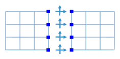

# Intro
FETI-1 or simply FETI (Finite Element Tearing & Interconnecting) is a DDM method introduced by Farhat et al. (1991). It is the first implementation of a family of FETI methods, which use Lagrange multipliers to describe the forces between the subdomains and define the interface problem in terms of those. The Lagrange multipliers are dual quantities (e.g. forces in elasticity problems, while displacements are primal), these methods are often called **dual**. Later, other dual DDMs were developed as simpler and in many cases more efficient, alternatives. 

Before continuing to the theory presented next, it is recommended to read the [general DDM chapter](ch3_ddm_solvers.md). For a more detailed description of FETI-1, see [the original publication](https://www.researchgate.net/publication/227701161_A_Method_of_Finite_Element_Tearing_and_Interconnecting_and_Its_Parallel_Solution_Algorithm).

# Theory

## Lagrange multipliers

In FETI-1 method, the domain is divided into disconnected subdomains as in the above figure and the continuity between them is retained by enforcing equal displacements for instances of the same boundary DOF (degree of freedom). E.g. if subdomains `s=1,2` share the same boundary dof `k`:

By gathering the 1, -1 and 0 coefficients in a signed boolean matrix **B**s for all boundary DOFs of a subdomain *s*, we get series of continuity equations:

To solve the initial linear system in the presence of these constraints, we apply Lagrange multipliers at boundary DOFs. These are dual quantities and can be viewed as forces, while displacements are primal quantities. The resulting linear system is written as:

where the superscript e denotes a matrix/vector where each subdomain matrix/vector contribution (with superscript s) is placed one after the other, without any overlap.

## Floating subdomains

A subdomain of FETI-1 can be “floating”, meaning there are not enough constrained DOFs and its stiffness matrix **K**s is singular. To overcome this, we use a generalized inverse (**K**s)* and a normalized basis for its nullspace **R**s, which corresponds to the rigid body motions of the floating subdomain.

where the subscripts 1/2 denote linearly independent/dependent rows and columns, respectively. If the subdomain has sufficient constraints then **R**s is empty and (**K**s)* = (**K**s)-1. 

## Interface problem
The interface problem of FETI-1 is as follows:

where **a** expresses linear combinations of the normalized rigid body motions in **R**, **F**I is the flexibility matrix, **G** aggregates the rigid body motions, **d** are the displacements due to applied forces (boundary conditions and loading) and **e** is the work of rigid body motions due to these applied forces:

The linear system written above is not symmetric positive definite. To solve it using the preconditioned conjugate gradient (PCG) method, we must project it into another space using a projection matrix **P** and then solve the final linear system of the interface problem:

where

Finally we calculate the displacements depending on if the subdomain is floating or not:

<

## Coarse problem
The coarse problem of FETI-1 is expressed in the linear system  contained in the interface problem system above. It helps speed up convergence by globally distributing the error at each PCG iteration. 

## Preconditioning
FETI-1 uses a standard preconditioner to speed up the convergence of PCG when solving the interface problem. The idea is to approximate the inverse of the flexibility matrix, which is defined for the boundary DOFs. The most common preconditioners used are Dirichlet and lumped.

### Dirichlet preconditioner
Dirichlet preconditioner is defined as:

where **S**s is the Schur complement of internal dofs

 are sparse matrices that perform mapping (like **B**s) and scaling. E.g. for a homogeneous stiffness distribution among subdomains:

where  are the columns of  corresponding to boundary DOFs (boundary remainder in FETI-DP) and  is a diagonal matrix whose diagonal entries are the multiplicity of the corresponding DOFs, i.e. how many subdomains have instances of the DOFs.

### Lumped preconditioner
Lumped preconditioner is defined as:

In general, lumped preconditioners are faster to compute and implement, but does not speed up the convergence of PCG as much as Dirichlet.

### Diagonal Dirichlet preconditioner
Diagonal Dirichlet preconditioner is defined as:

where  is an approximation of the Schur complement of internal dofs. 

where  is the diagonal of . 

In general, the computational cost of computing and implementing a diagonal Dirichlet 
preconditioner, as well as the resulting reduction of PCG iterations falls 
between that of Dirichlet and lumped preconditioner.

# Remarks
FETI-1 is an efficient DDM that exhibits good scalability, namely the iterations required to converge do not increase as the number of subdomain increases. This makes it applicable to large scale simulations run on computing systems with a lot of networked computers. Its disadvantages are caused by the existence of floating subdomains, the processing of which is difficult and very sensitive to accuracy loss. Floating subdomains and rigid body motions also cause problems when FETI-1 is applied to dynamic problems.