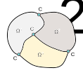

# FETI-DP Introduction
FETI-DP (Dual-Primal FETI) is a DDM DDM method introduced by Farhat et al. (2003), as a simpler and in many cases more efficient, alternative to FETI-1. FETI-DP is based on a dual-primary formulation of the problem to be solved. The main difference between the FETI-DP method and FETI-1 is that in FETI-DP, in every iteration of the PCG method, the compatibility of displacements is imposed to a small subset of primal **corner** DOFs, while the compatibility of displacements of the remaining boundary DOFs is only achieved after convergence.  

Before continuing to the theory presented next, it is recommended to read the chapters on [general DDMs](ch3_ddm_solvers.md) and [FETI-1](ch3_1_feti1.md). For a more detailed description of FETI-DP, see [the original publication](https://www.researchgate.net/publication/51992274_A_scalable_dual-primal_domain_decomposition_method).

# FETI-DP Theory

## Primal & dual DOFs

For a given mesh partition, we define its corners as the set of nodes located at the beginning and end of each edge of each subdomain, as illustrated in the figure above. Using this definition in 2D problems, the set of corner nodes will include all crosspoints, namely nodes belonging to more than two subdomains.

The freedom degrees (DOFs) associated with these corner nodes will be called **corner** or **primal** DOFs and designated with the subscript *c*. The other DOFs of each subdomain will be called **remainder** DOFs and designated the subscript *r*. E.g. if we denote by **K**s, **u**s and**f**s the stiffness matrix, displacement vector and force vector of vector of subdomain *s* respectively, these quantities are then decomposed based on the DOFs:

We further decompose remainder DOFs into **internal** DOFs, which are associated with nodes that belong to only one subdomain and are designated by the subscript *i*, and **boundary-remainder** DOFs, which are associated with nodes that belong to more than one subdomains without being corners and are designated by the subscript *b*. E.g.

We gather the displacements corresponding to all corner dofs of the whole domain in a vector $u_c$ of length *N_c* and define the mapping between global  and subdomain  as boolean matrices  that have 0/1 entries and dimensions , where  and  are the number of corner DOFs of subdomain *s* and the whole domain, respectively.

As in FETI-1, the continuity between the otherwise diconnected subdomains is retained by enforcing equal displacements for instances of the same boundary DOF in different subdomains. E.g. if subdomains *s=1,2* share the same boundary dof *k*:

These continuity equations are gathered into signed boolean matrices  which have 0, 1, -1 entries and dimensions , where  is the number of continuity equations of the whole domain and  the number of subdomain's *s* remainder dofs:

To solve the initial equilibrium equations **K u = f** in the presence of these constraints, we apply Lagrange multipliers **λ** at boundary DOFs, as illustrated in the figure above. These are dual quantities and can be viewed as forces, while displacements are primal quantities. It should be clarified that no Lagrange multipliers are applied at corner dofs. The equilibrium equations can then be written as:

## Interface problem

With an appropriate selection of corner nodes  is an invertible matrix, meaning that the floating subdomains of the original FETI method are avoided in FETI-DP. We can then consider each subdomain as a superelement that has the subdomain's corners as nodes. The stiffness and applied forces of this superelement are obtained by perform static condensation of the remainder DOFs. Then we assemble the resulting matrices/vectors into global ones, exactly as we would do with individual elements in FEM.

Since  is positive definite, its Schur complement is also positive definite. Assembling these Schur complements into $\bm{K}_{cc}^*$ also results in a positive definite matrix. We also set the following quantities:

Note that  is essentially the inverse of the original stiffness matrix of the whole domain, limited to boundary DOFs, hence a flexibility matrix. Furthermore  expresses the displacements, due to loading, along boundary dofs of the subdomains, as if they were not connected to each other. 

After some algebraic manipulation the equilibrium equation can be written as:

By decoupling the corner DOFs from the Lagrange multipliers, the linear system of the FETI-DP interface problem is obtained:

The matrix of the linear system above is positive definite, therefore the interface problem can be solved using the Preconditioned Conjugate Gradient method (PCG). After solving it for the Lagrange multipliers **λ**, the displacements at corner and remainder DOFs can be calculated by

## Coarse problem
During the solution of the interface problem, at each matrix-vector multiplication:  

performed in PCG, we need to solve the linear system 

. 

This linear system expresses the coarse problem of FETI-DP: a much smaller auxilliary problem involving only corner DOFs, that speeds up convergence by coupling the subdomain computations and globally propagating the error at each PCG iteration.

## Preconditioning
FETI-DP uses the same preconditioners as FETI-1 to speed up the convergence of PCG when solving the interface problem. The only difference is that boundary corner DOFs are not taken into account in the preconditiones, since in FETI-DP they are not part of the interface problem. Therefore all matrices with the index *b* refer to the boundary-remainder DOFs, instead of all boundary DOFs. For more details, see [FETI-1 preconditioners](ch3_1_feti1.md##Preconditioning)

# FETI-DP Remarks
FETI-DP is an efficient DDM that exhibits good scalability, namely the iterations required to converge do not increase as the number of subdomains increases. This makes it applicable to large scale simulations run on computing systems with a lot of networked computers. By using a set of primal (corner) DOFs, it avoids the floating subdomains of FETI-1 and all their problems, therefore it is much simpler to comprehend and implement. Furthermore, it is often more efficient than FETI-1.